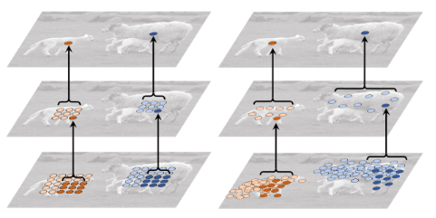

# 可变性卷积
可变性卷积是指卷积核在每个元素上额外增加一个参数-方向参数,可以是的卷积核在卷积过程中扩展到更多样形状的感受野.
https://zhuanlan.zhihu.com/p/506189394
## 为啥用可变性卷积
传统卷积核一般四固定尺寸,固定大小的,这会使得卷积对未知的便变化适应性差,泛化能力不足.

卷积层对特征图进行采样,池化层减小特征图尺寸,这使得空间位置受限,同一层CNN的激活单元的感受野都相同,但是不同位置可能对应有不同尺度或者不同形变的物体,这些层需要能够自动调整尺度或者感受野的方法.
核心思想:网络的卷积核可以根据实际情况调整本身的形状,更好的提取输入数据的特征.

## 可变形卷积的结构
可变形卷积的输入和正常卷积输入一样,输出包含两部分,一个是偏差层的输出特征还有一个常规卷积输出,两者特征图尺寸一致,最后生成的特征图通道为2N,分别对应原始输出和偏移特征,两者经过双线性插值后向后传播算法进行同时学习.

与普通卷积的主要差异在于卷积的采样区域,虽然采样点都是3x3,但是可变形卷积在采样时可以更贴近物体的形状和尺寸.

## 可变形卷积的实现
在传统卷积的基础之上,增加了调整卷积核的方向向量,使得卷积核更贴近RIO特征物,其实现分为几个流程

1. 输入与正常卷积网络一致,使用传统卷积和提取特征图
2. 把得到的特征图作为输入,对特征图再施加一层卷积层,这样做是为了获得可变形卷积变形的偏移量
3. 偏移层是2N,在2维平面做偏移,需要改变x和y的值.
4. 训练阶段,输出常规特征图的卷积核和用于生成偏移量的卷积核是同步学习的.偏移量的计算是利用插值算法,以实现反向传播.

```
class DeformConv2d(nn.Module):
    def __init__(self, inc, outc, kernel_size=3, padding=1, stride=1, bias=None, modulation=False):
        # 求offset的卷积层, 生成卷积核各元素在x,y两个方向上的偏移量(2*,如果是一维应该就是k_s输出通道数,因为只有一个方向). 
        self.p_conv = nn.Conv2d(inc, 2*kernel_size*kernel_size, kernel_size=3, padding=1, stride=stride)
        nn.init.constant_(self.p_conv.weight, 0)
 
        self.conv = nn.Conv2d(inc, outc, kernel_size=kernel_size, stride=kernel_size, bias=bias)

    def forward(self, x):
        offset = self.p_conv(x) # (batch, 2N, h/stride, w/stride) 输出数据的维度可以看作每个核元素都有一个作用的数据在原数据像素点的x,y坐标.
        # (b, 2N, h, w) 获取公式中的坐标p
        p = self._get_p(offset, dtype)

        ''' 双线性插值部分 '''
        p = p.contiguous().permute(0, 2, 3, 1)
        q_lt = p.detach().floor()
        q_rb = q_lt + 1

        q_lt = torch.cat([torch.clamp(q_lt[..., :N], 0, x.size(2)-1), torch.clamp(q_lt[..., N:], 0, x.size(3)-1)], dim=-1).long()
        q_rb = torch.cat([torch.clamp(q_rb[..., :N], 0, x.size(2)-1), torch.clamp(q_rb[..., N:], 0, x.size(3)-1)], dim=-1).long()
        q_lb = torch.cat([q_lt[..., :N], q_rb[..., N:]], dim=-1)
        q_rt = torch.cat([q_rb[..., :N], q_lt[..., N:]], dim=-1)

        # clip p
        p = torch.cat([torch.clamp(p[..., :N], 0, x.size(2)-1), torch.clamp(p[..., N:], 0, x.size(3)-1)], dim=-1)

        # bilinear kernel (b, h, w, N)
        g_lt = (1 + (q_lt[..., :N].type_as(p) - p[..., :N])) * (1 + (q_lt[..., N:].type_as(p) - p[..., N:]))
        g_rb = (1 - (q_rb[..., :N].type_as(p) - p[..., :N])) * (1 - (q_rb[..., N:].type_as(p) - p[..., N:]))
        g_lb = (1 + (q_lb[..., :N].type_as(p) - p[..., :N])) * (1 - (q_lb[..., N:].type_as(p) - p[..., N:]))
        g_rt = (1 - (q_rt[..., :N].type_as(p) - p[..., :N])) * (1 + (q_rt[..., N:].type_as(p) - p[..., N:]))

        # (b, c, h, w, N)
        x_q_lt = self._get_x_q(x, q_lt, N)
        x_q_rb = self._get_x_q(x, q_rb, N)
        x_q_lb = self._get_x_q(x, q_lb, N)
        x_q_rt = self._get_x_q(x, q_rt, N)

        # (batch_size, in_channel, h, w, N)
        x_offset = g_lt.unsqueeze(dim=1) * x_q_lt + \
                   g_rb.unsqueeze(dim=1) * x_q_rb + \
                   g_lb.unsqueeze(dim=1) * x_q_lb + \
                   g_rt.unsqueeze(dim=1) * x_q_rt

        ''' 整形，方便卷积计算  → (batch_size, in_channel, kernel*h, kernel*w)'''
        x_offset = self._reshape_x_offset(x_offset, ks)

        out = self.conv(x_offset)
```