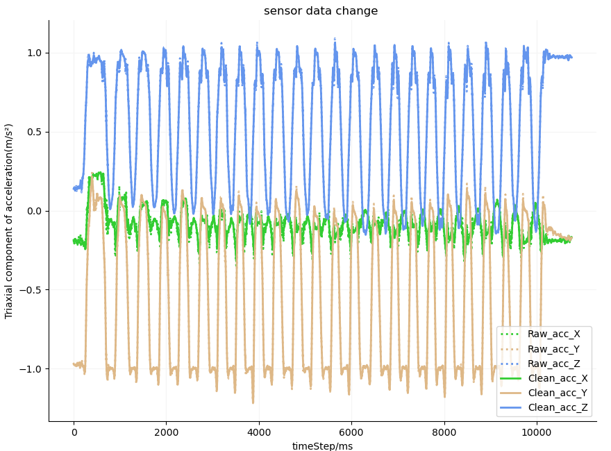
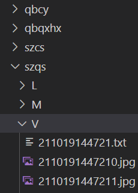
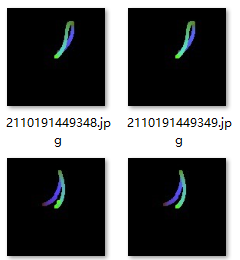
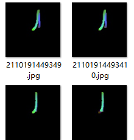
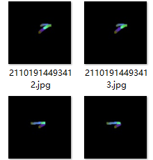

# 动作识别
基于可穿戴设备对人体上肢运动信息进行数字化，以时间为基准轴，每个时间步均对应一条记录，内包含基于当前载体坐标系的正交三轴加速度计记录的加速度值，三轴陀螺仪记录的角速度值，另有解算得到的三轴姿态角，温度等数据。记录的时间序列数据隐含着丰富的运动信息。人的动作识别是模式识别领域的一项重要任务，而动作识别的框架性能很大程度上取决于特征的选取和表示，相较于常见的基于统计IMU加速度特征信息来用于动作识别，其可解释性和可扩展性存在局限，本文旨在寻求一种方法特征化上肢的运动信息，使模型具备更好的识别准确率和可解释性。同时减少计算量。

常见的识别方法可分为基于视觉（RGB，RGB-D）, 基于MEMS传感器数据的识别，基于肌电信号的识别（EMG），视觉识别在当前是较为成熟的识别领域，但由于光学传感器对光线及场景依赖较大，且对于遮挡或视角固定等问题会导致识别性能受到影响，同时视觉还存在尺度不一、视角维度单一、数据冗余等问题。传感器设备具备便携、低成本、低能耗等优点，用于上肢动作分类识别方法基于IMU加速度统计特征，但其识别方法存在可解释性差，人工特征选取的不确定性，数据源单一等问题。本文旨在构建一种更具可解释性，特征化上肢动作的运动信息，计算量小且高性能的动作识别模型。

本文设计并提出合适的算法进行数据融合，将时间序列数据解算得到载体运动在三维空间中的位移轨迹及方向速度等运动信息，引入全投影式轨迹编码方法，将运动信息可视化并编码以图像形式进行样本生成，结合迁移学习思想，构建分类模型，是一种更为完善的识别方法，提出的范式中，通过全投影式轨迹编码方法生成的图像仅包含载体的空间运动位移轨迹和其他运动特征信息，同时很好的保留了时间和空间信息，这为结合常用于捕获空间信息的高性能DCNN网络提供了铺垫，同时，为更好学习运动轨迹的时间相关性特征，本文结合滑动窗口对区间内轨迹生成训练样本，

改进点：
1. 本文基于传统惯性导航技术，针对低精度传感器设备的数据测量误差及累积误差导致问题，进行改进。基于三特征法的零速修正有效减少了传感器测量误差引起的位移偏移，而提出的姿态观测利用上肢周期性运动特性，对位移进行周期性修正，有效减小了累计误差导致的位移偏差随时间越来越大的问题。
2. 复现的3维运动轨迹能有效地描述动作，为有效保留运动的时空运动信息，包括运动方向，运动速度、位移轨迹，本文提出将解算得到的运动信息转换为全投影式轨迹编码图，在保留了完整的3维运动信息情况下，不存在其他视觉干扰及噪声，具有视觉不变性, 对尺度变化、时间速度变化,以及局部噪声和局部遮挡具有鲁棒性.同时为下一步识别做下工作铺垫。
3. 结合人工神经网络，构建分类器，为了避免丢失详细的局部连续运动信息，提出将轨迹数据细化成基于滑动时间窗口分割的全投影式轨迹编码图，用分割后得到的图像子集描述连续动作的运动轨迹，提升模型的识别性能。


## 动作集设计

参考常用运动功能评定量表(***Fugl-Meyer***)设计出四个上肢动作。[1]

1.	坐体位上肢前展：坐在椅子上，将偏瘫侧上肢尽量水平抬高。
1.  坐体位上肢侧展：坐在椅子上，将偏瘫侧上肢尽量向外侧抬高。
2.  坐体位前臂旋前(Forearm pronation)旋后((Forearm supination)):坐在椅子上，将偏瘫侧上肢抬高至水平位置，完成前臂旋前旋后。
3.  站立触腰：保持站立姿势，将偏瘫侧上肢向后移至腰椎。

最好配上初始态+过渡态+最终态示意图。

## 数据预处理
MEMS传感器数据的误差来源可由生产工艺，测量过程误差，震动、撞击或温度变化导致陀螺仪漂移，都会导致采集的数据存在异常值或者误差，所以原始的MEMS数据其实并不完全可靠，这将会直接导致计算得到的轨迹产生偏差，间接影响模型分类识别的效果，所以数据通过预处理来把控数据的稳定性和可靠性是十分有必要的。

MEMS采集的为时间序列数据，本文在预处理上并没有引入过多的花哨操作，主要是对三轴加速度数据进行了异常值剔除，再经过低通滤波器，对高频噪声进行过滤，使得数据曲线更平滑，一定程度上消除测量噪声。过多的数据预处理不一定会提升数据质量，反而有可能会导致数据失真。

### 平滑去噪

```python
# 数据预处理:去除异常值，低通滤波去除高频噪声
listacc_X = dataProcess.abnormal_discard(listacc_X, 0.9)
listacc_Y = dataProcess.abnormal_discard(listacc_Y, 0.9)
listacc_Z = dataProcess.abnormal_discard(listacc_Z, 0.9)
a_listacc_X, a_listacc_Y, a_listacc_Z = filters.LowPass(
    listacc_X, listacc_Y, listacc_Z)
```



如上图，对连续的三轴加速度数据进行异常值剔除和低通滤波平滑后，三轴加速度的前后对比，由于原始数据采用同色散点绘图，可明显看到偏离出的异常数据点，数据的平滑细粒度上图由于分辨率问题，无法直观看出对比效果。实际截取部分放大效果会较为明显。

## 全投影式轨迹编码图（位移轨迹追踪）
全投影式轨迹编码图其基本理念是通过多视角下对载体在3维空间内的运动位移轨迹进行投影，充分保留运动轨迹的空间信息，这相较于仅仅依靠二维图像数据获取的载体的空间位移信息更加丰富全面。同时，为进一步保留和丰富载体的运动特征，使其更具可区分性，本文通过三通道映射，将运动方向、运动速度、运动部位（***本文为单个固定节点，为多节点预留***），以轨迹为载体，编码生成全投影式轨迹编码图。基本流程如下图。

++配个轨迹编码流程图++

#### 代码实现:
```python
 img = np.zeros([128, 128, 3], dtype="uint8")
    if postition == 'L':  # 左视图
        Tra_Y = Tra_Y
    if postition == 'M':  # 主视图
        Tra_Y = Tra_X
    if postition == 'V':  # 俯视图
        Tra_Z = Tra_X
    for i in range(1, high):
        i = high - i
        img[(int(Tra_Z[i]*100)+62):(int(Tra_Z[i]*100)+66), (int(Tra_Y[i]*100)+62):(int(Tra_Y[i]*100)+66), 0] = V[i]/max(V)*255  # blue：运动速度
        img[(int(Tra_Z[i]*100)+62):(int(Tra_Z[i]*100)+66), (int(Tra_Y[i]*100)+62):(int(Tra_Y[i]*100)+66), 1] = (1-(i/high))*255  # green: 离初始态时间越远，该通道颜色值越浅，考虑到传感器数据随时间推移可靠性降低的现实情况。
        img[(int(Tra_Z[i]*100)+62):(int(Tra_Z[i]*100)+66), (int(Tra_Y[i]*100)+62):(int(Tra_Y[i]*100)+66), 2] = T/3*255  # red   # 本文固定单节点部位，固定值T=1
    img = cv2.flip(img, 0)
```

#### 三面投影
++投影视图说明++
#### RGB三通道编码
++计算映射公式定义++

#### 文件结构


#### 编码图:

 

  



上图分别为最终生成的三视角投影轨迹编码图。

## 基于全投影式轨迹编码图的连续周期动作智能识别


### 滑动窗口


### 网络模型


### 模型评估