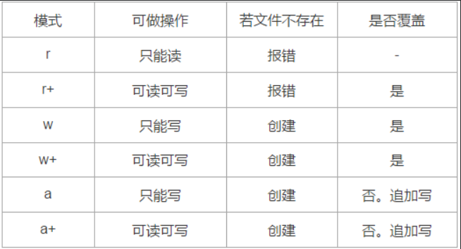
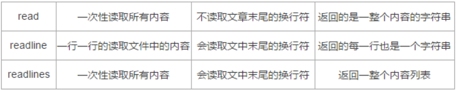

# python 文件读写
### python通过获取到文件的内存对象（文件句柄），来对文件进行操作（读取，写入等）  

## 什么是文件的内存对象？  
### 文件句柄包含文件名、文件字符集、文件大小、文件在硬盘上的起始地址。

## 例：
```
 f = open(r'samples.txt','r', encoding = 'utf-8')

 data = f.read()  # 读文件内容
 print(data[:-1])
 f.close()
```

```
 f = open(r'samples.txt','w', encoding = 'utf-8')

 data = f.write('内容')  # 读文件内容
 print(data[:-1])
 f.close()
```
## 注：f句柄指向文件地址，要实现连续读写，需注意f的调整，每次读写，f都会指向文件末尾位置，可通过f.seek(0)调整位置到文件开头。



### r+模式为可读可写，前提是文件存在  w+也为可读可写，在文件不存在时可以创建。a+可追加写，且以a+模式打开文件句柄默认放在内容末尾，要想重头读取，需要调整位置f.seek(0)。

## read、readline、readlines


### read 一般用于一次性全部读入，从头到尾，不读换行符。 readline一次读一行，返回一行字符串。readlines全读，会读换行符，返回一整个内容列表


